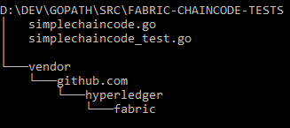

# Writing tests for fabric chaincode using mockstub
## Building chaincode on Windows
go build --tags nopkcs11

## Testing chaincode on windows 
go test --tags nopkcs11

## Code Dependencies
Clone the appropriate version of hyperledger fabric inside vendor. The vendor directory should be structured as below
 
